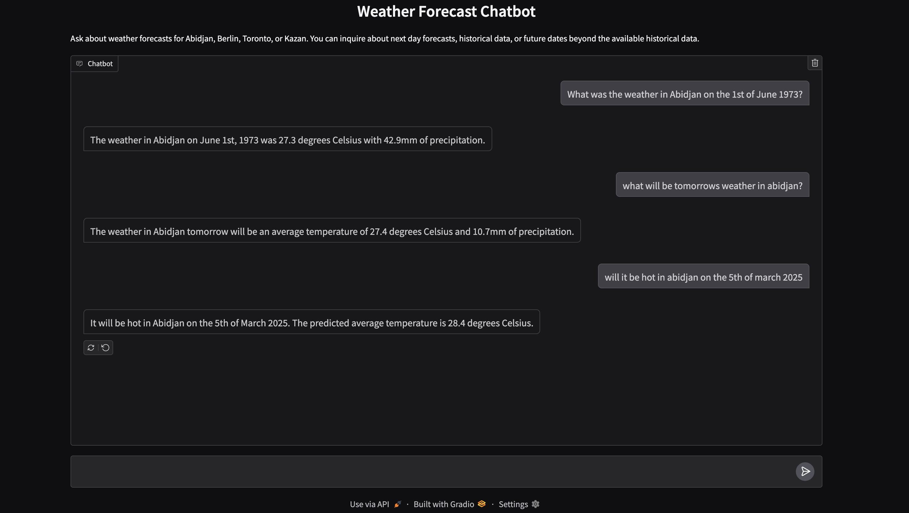

# Weather Assistant GenAI

Weather Assistant GenAI is a weather forecasting tool powered by Google's Gemini AI and Prophet. It supports historical weather data lookup and future weather forecasts for selected cities through natural language queries. The tool can be run via a Gradio chat interface or directly from the command line.



## Features

- Retrieve historical weather data for supported cities.
- Generate weather forecasts for future dates beyond the available historical data.
- Supports the following cities:
  - Abidjan
  - Berlin
  - Toronto
  - Kazan
- Interactive Gradio chat interface for user-friendly interaction.

## Requirements

### Setting Up and Activating a Virtual Environment (Recommended)

It's recommended to use a virtual environment to manage dependencies for this project.

#### For macOS/Linux

```bash
python3 -m venv venv
source venv/bin/activate
```

#### For Windows

```bash
python -m venv venv
venv\Scripts\activate
```

Install the required dependencies using the `requirements.txt` file:

```bash
pip install -r requirement.txt
```

You'll need Google Gemini API KEY

You can get your Gemini API KEY [HERE](https://aistudio.google.com/app/apikey)

# Usage
### Running the Gradio Chat Interface
To launch the Gradio chat interface, run the following command:

```python
python app.py --api_key <YOUR_GOOGLE_GEMINI_API_KEY>
```

Replace <YOUR_GOOGLE_GEMINI_API_KEY> with your actual API key.

### Running in Command-Line Mode
To run the tool in command-line mode, set the --interface flag to False and provide a prompt using the --prompt argument

```python
python app.py --api_key <YOUR_GOOGLE_GEMINI_API_KEY> --interface False --prompt "What will the temperature in Abidjan look like on the 20th of May 2025?"
```

# Examples
### Example 1: Historical Weather Data
#### To retrieve historical weather data for Abidjan on June 1, 1973:
```python
python app.py --api_key <YOUR_GOOGLE_GEMINI_API_KEY> --interface False --prompt "What was the weather in Abidjan on the 1st of June 1973?"
```

### Example 2: Future Weather Forecast
#### To forecast the weather in Berlin on May 20, 2025:
```python
python app.py --api_key <YOUR_GOOGLE_GEMINI_API_KEY> --interface False --prompt "What will the temperature in Berlin look like on the 20th of May 2025?"
```

### Example 3: Next Day Forecast
#### To get the next day's weather forecast for Toronto:
```python
python app.py --api_key <YOUR_GOOGLE_GEMINI_API_KEY> --interface False --prompt "How much precipitation is expected in Toronto tomorrow?"
```